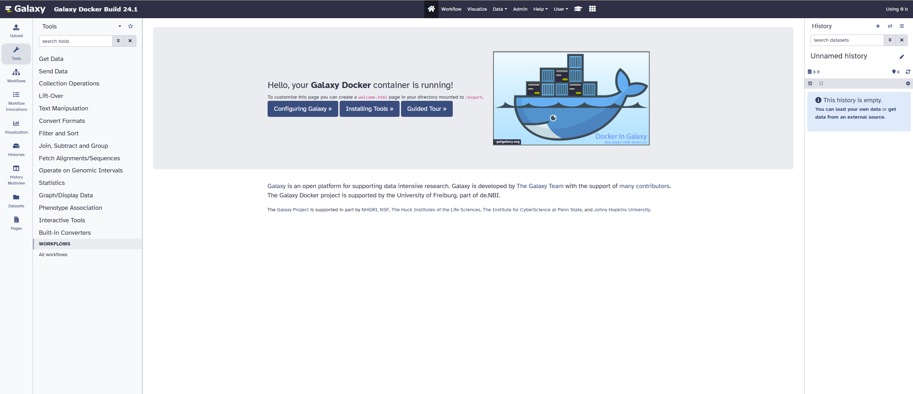
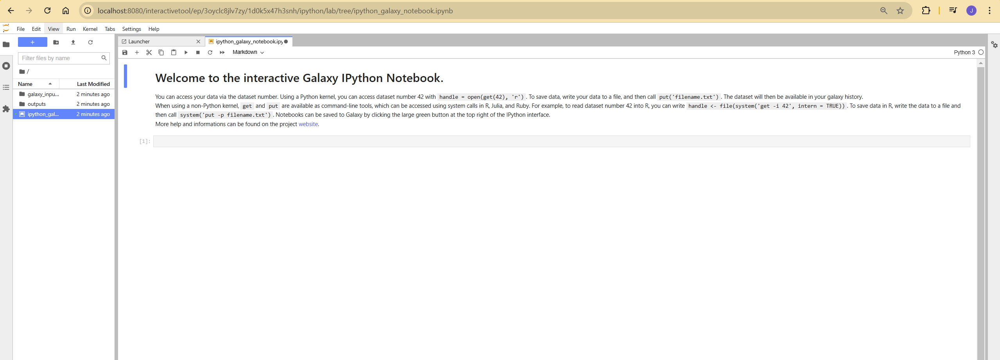

# Galaxy Docker 24.1

We are excited to announce the release of the Galaxy Docker Image version 24.1 which is now available as `quay.io/bgruening/galaxy:24.1`! 
This update incorporates major changes to the underlying Galaxy stack, offering performance enhancements, 
new features, and service improvements. Below is a detailed breakdown of what’s new and how to make the most of this updated version.

## Highlights of the Update

### Base Upgrades

- Operating System: Upgraded from Ubuntu 18.04 to Ubuntu 22.04.
- Galaxy Version: Transitioned from version 20.09 to 24.1, bringing new features and optimizations.
- PostgreSQL Database: Upgraded from version 11 to 15, enhancing database performance.
- Python Interpreter: Upgraded from Python 3.7 to Python 3.10, now the default interpreter for Galaxy.
- Migration to Maintained Ansible Roles: We have replaced the older [ansible-galaxy-extras](https://github.com/galaxyproject/ansible-galaxy-extras) git submodule 
with actively maintained Ansible roles, making the setup more modular and maintainable.

These upgrades ensure compatibility with the latest dependencies and security standards.

### Enhanced Dockerfile Architecture

The Dockerfile now employs a multi-stage build approach, resulting in a smaller, optimized image that includes 
only essential files. This change reduces resource consumption without sacrificing functionality.

### New and Updated Services
#### Web Server and Task Management
- Gunicorn: Replaces uWSGI as the Galaxy web server, improving scalability and resource efficiency.
- Celery & Celery Beat: Introduced for distributed task management and periodic task execution, supported by:
    - RabbitMQ: Acts as the broker for Celery.
    - Redis: Functions as the backend for Celery.
    - Flower: Provides monitoring and debugging capabilities for Celery tasks.
#### Additional Services
- TUSd: Added to support fault-tolerant uploads for large files.
- gx-it-proxy: Introduced to support Interactive Tools (ITs).
- RabbitMQ Management Plugin: Enabled for easier monitoring and management of the RabbitMQ server.

- Miniforge is now the default Conda installer in the Galaxy Docker image, focusing on the conda-forge and bioconda channels for package management.
- Gravity: Manages core Galaxy services like Gunicorn, Celery, TUSd, gx-it-proxy, reports, and job handlers. This change simplifies configuration and improves service management.
- With the deprecation of Galaxy Interactive Environments (GIEs), Interactive Tools (ITs) are now the recommended approach for extending Galaxy with powerful services like Jupyter and RStudio.

### Getting Started with Galaxy Docker
Setting up the Galaxy Docker container is simple and straightforward. Here’s how to get started:

#### Basic Galaxy Docker Run
To launch the Galaxy container:

    docker run -d -p 8080:80 quay.io/bgruening/galaxy

This will start Galaxy on port 8080 of your host machine. Galaxy will be accessible at `http://localhost:8080`.
To preserve your data between container restarts, use Docker volumes to mount a local folder to the container:

    docker run -d -p 8080:80 -v /home/user/galaxy_storage/:/export/ quay.io/bgruening/galaxy

This will mount `/home/user/galaxy_storage` from the host to `/export/` inside the container, allowing you to save and retrieve data.

#### Enabling Interactive Tools
Interactive tools allow for running services like Jupyter Notebooks securely within Galaxy. To enable this functionality:

    docker run -d -p 8080:80 -p 8021:21 -p 4002:4002 --privileged=true -v /home/user/galaxy_storage/:/export/ -e "GALAXY_DESTINATIONS_DEFAULT=slurm_cluster_docker" quay.io/bgruening/galaxy

### Deprecation Notice
The Compose setup for deploying Galaxy is no longer maintained. Users are encouraged to focus on the single-container version of 
the Galaxy Docker image. If you are looking for a composable version, you can explore [Galaxy Helm](https://github.com/galaxyproject/galaxy-helm).

We hope you enjoy the new version of the Galaxy Docker Image. With better performance, and new features, it’s the perfect tool for your data analysis needs.
As always, feel free to reach out with questions, feedback, or issues.

  [1] https://github.com/bgruening/docker-galaxy/blob/main/Changelog.md#241
  [2] https://docs.galaxyproject.org/en/master/releases/24.1_announce_user.html
